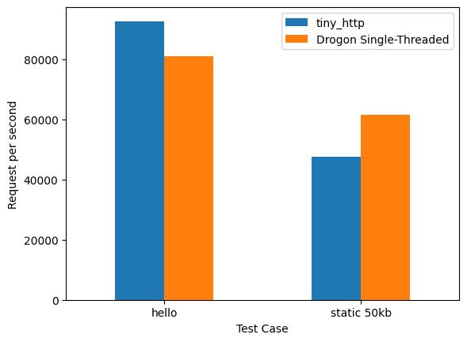

# tiny_http - Work in Progress...
<div align="center">

[](https://github.com/RaphiaRa/tiny_http/actions/workflows/linux.yml)
[](https://github.com/RaphiaRa/tiny_http/actions/workflows/macos.yml)

</div>
tiny_http is my attempt at creating a lightweight, easy-to-use, and embeddable HTTP server library in C99.

##### Hello, World! Example:
```c
#include "th.h"

static th_err
handler(void* userp, const th_req* req, th_resp* resp)
{
    th_set_body(resp, "Hello, World!");
    th_add_header(resp, "Content-Type", "text/plain");
    return TH_ERR_OK;
}

int main()
{
    th_server* server;
    th_server_create(&server, NULL);
    th_bind(server, "0.0.0.0", "8080", NULL);
    th_route(server, TH_METHOD_GET, "/", handler, NULL);
    while (1) {
        th_poll(server, 1000);
    }
    return 0;
}
```
Simply copy the code above to a file (e.g. `hello.c`) where you have the `th.h` and `th.c` files, and compile it with:
```sh
$ gcc -o hello hello.c th.c
```
Then run the server with:
```sh
$ ./hello
```

I wrote this library because I wanted a simple drop-in solution for the legacy C and C++ codebases I work with, hence the lack of dependencies and new language features. It is not designed to be a full-fledged web server, but rather a simple tool to build small web applications or to serve static files. No threading or forking is used.

## Features

- Simple integration (just copy the `th.h` and `th.c` files to your project)
- HTTPS support (via OpenSSL) (Works, but still needs to be optimized as it's quite slow)
- Path capturing (e.g. `/user/{id}`)
- Supports Linux and MacOS (Windows support is planned)
- Fully customizable memory allocation and logging
- File Uploads (Multipart form data)

## Planned features

- Websockets

## Dependencies

- The C standard library
- OpenSSL (optional, for HTTPS support)
- gperf (optinal, for binary builds and amalgamation)
- python3 (optional, for running the amalgamation script)

## Enabling HTTPS

To enable HTTPS support, you need to link against OpenSSL and set `TH_WITH_SSL=1` when compiling the library.
```sh
$ gcc -o myserver myserver.c th.c -lssl -lcrypto -DTH_WITH_SSL=1
```
Pass the certificate and private key file paths to `th_bind`:
```c
th_bind_opt opt = {
    .cert_file = "cert.pem", 
    .key_file = "key.pem",
};
th_bind(server, "0.0.0.0", "433", &opt);
```

## Logging

Logging can be configured via the `TH_LOG_LEVEL` macro.
```c
$ gcc -o myserver myserver.c th.c -DTH_LOG_LEVEL=TH_LOG_LEVEL_TRACE
```
Possible values are:
```c
TH_LOG_LEVEL_NONE
TH_LOG_LEVEL_ERROR
TH_LOG_LEVEL_WARN
TH_LOG_LEVEL_INFO
TH_LOG_LEVEL_DEBUG
TH_LOG_LEVEL_TRACE
```
By default, tiny_http logs to `stderr`,
but users can provide their own logging function (See [examples/custom_logger.c](examples/custom_logger.c)).

## Building binaries, examples, and tests

Library builds, examples, and tests can be built using CMake (This requires gperf to be installed).
```sh
$ mkdir build; cd build
$ cmake ..
$ make
```

## More examples

Example - Path capturing:
```c
#include "th.h"

static th_err
handler(void* userp, const th_req* req, th_resp* resp)
{
    const char* msg = th_find_pathvar(req, "msg");
    th_printf_body(resp, "Hello, %s!", msg);
    th_add_header(resp, "Content-Type", "text/plain");
    return TH_ERR_OK;
}

int main(void)
{
    th_server* server;
    th_server_create(&server, NULL);
    th_bind(server, "0.0.0.0", "8080", NULL);
    th_route(server, TH_METHOD_GET, "/{msg}", handler, NULL);
    while (1) {
        th_poll(server, 1000);
    }
    return 0;
}
```
It's possible to specify a capture type by adding a colon before the parameter name: `{string:param}` (Default if nothing is specified), `{int:param}`, `{path:param}`.

Example - File serving:
```c
#include "th.h"

static th_err
handle_path(void* userp, const th_req* req, th_resp* resp)
{
    const char* path = th_find_pathvar(req, "path");
    th_set_body_from_file(resp, "root", path);
    return TH_ERR_OK;
}

static th_err
handle_index(void* userp, const th_req* req, th_resp* resp)
{
    th_set_body_from_file(resp, "root", "index.html");
    return TH_ERR_OK;
}

int main(void)
{
    th_server* server;
    th_server_create(&server, NULL);
    th_bind(server, "0.0.0.0", "8080", NULL);
    th_add_dir(server, "root", "/path/to/your/files");
    th_route(server, TH_METHOD_GET, "/{path:path}", handle_path, NULL);
    th_route(server, TH_METHOD_GET, "/", handle_index, NULL);
    while (1) {
        th_poll(server, 1000);
    }
    return 0;
}
```

More detailed examples can be found in the `examples` directory.

## Performance

Although tiny_http is not designed to be high-performance, it's still quite fast.
Here is a comparison with [Drogon](https://github.com/drogonframework/drogon) (One of my favorite C++ web frameworks) on my cloud server (2 dedicated AMD Epyc vCPUs).
[](benchmark/benchmark.md)

Notes:
- Drogon will, of course scale much better with more threads. This is just to give a rough idea of tiny_http's performance.
- The slower static file test is probably because of tiny_http not using `sendfile` on Linux yet.
